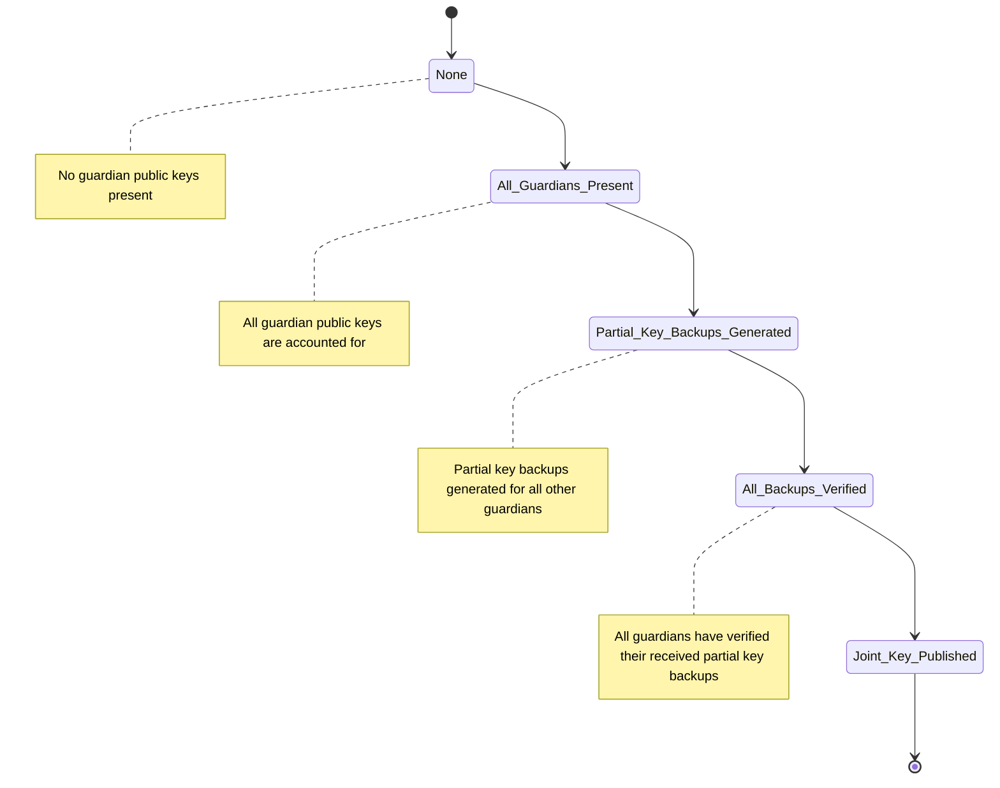

# Key Ceremony

## Glossary

- **Election Key Pair:** Pair of keys (public & secret) used to encrypt/decrypt election
- **Auxiliary Key Pair:** Pair of keys (public & secret) used to encrypt/decrypt information sent between guardians
- **Election Partial Key Backup:** A point on a secret polynomial and commitments to verify this point for a designated guardian.
- **Election Polynomial:** The election polynomial is the polynomial that is used for key sharing. A different point of the polynomial is shared with each recipient guardian. This allows the guardians together to determine the polynomial and subsequently the key for the sender guardian if they are missing.
- **Joint Key:** Combined public key from election public keys of each guardian
- **Quorum:** Quantity of guardians (k) that is required to decrypt the election and is less than the total number of guardians available (n)

## Process

1. The ceremony details are decided upon. These include a `number_of_guardians` and `quorum` of guardians required for decryption.
2. Each guardian creates a unique `id` and `sequence_order`.
3. Each guardian must generate their `auxiliary key pair`.
4. Each guardian must give the other guardians their `auxiliary public key` directly or through a mediator.
5. Each guardian must check if all `auxiliary public keys` are received.
6. Each guardian must generate their `election key pair` _(ElGamal key pair)_. This will generate a corresponding Schnorr `proof` and `polynomial` used for generating `election partial key backups` for sharing.
7. Each guardian must give the other guardians their `election public key` directly or through a mediator.
8. Each guardian must check if all `election public keys` are received.
9. Each guardian must generate `election partial key backup` for each other guardian. The guardian will use their `polynomial` and the designated guardian's `sequence_order` to create the value. The backup will be encrypted with the designated guardian's `auxiliary public key`
10. Each guardian must send each encrypted `election partial key backup` to the designated guardian directly or through a `mediator`.
11. Each guardian checks if all encrypted `election partial key backups` have been received by their recipient guardian directly or through a mediator.
12. Each recipient guardian decrypts each received encrypted `election partial key backup` with their own `auxiliary private key`
13. Each recipient guardian verifies each `election partial key backup` and sends confirmation of verification
    - If the proof verifies, continue
    - If the proof fails
      1. Sender guardian publishes the `election partial key backup` value sent to recipient as a `election partial key challenge` where the value is **unencrypted** to all the other guardians \*
      2. Alternate guardian (outside sender or original recipient) attempts to verify key
         - If the proof verifies, continue
         - If the proof fails again, the accused (sender guardian) should be evicted and process should be restarted with new guardian.
14. On receipt of all verifications of `election partial private keys` by all guardians, generate and publish `joint key` from election public keys

\* **Note:** _The confidentiality of this value is now gone, but since the two Guardians are in the dispute, at least one is misbehaving and could be revealing this data._

## Key Ceremony (`key_ceremony.py`)

### Stateless Methods

`generate_elgamal_auxiliary_key_pair` generates the Auxiliary Key Pair

`generate_election_key_pair` generates the Election Key Pair and polynomial requiring only the quorum

`generate_election_partial_key_backup` generate a partial key backup aka a point on owner guardian's polynomial for a designated guardian. This point is created from the polynomial using the Guardian's sequence order.

`verify_election_partial_key_backup` verifies the election partial key backup provided by another guardian

`generate_election_partial_key_challenge` generates a challenge for another guardian to verify when the original recipient of the backup cannot verify.

`verify_election_partial_key_challenge` verifies the election partial key challenge provided by another guardian when the original recipient's verification failed.

`combine_election_public_keys` combines the guardian's public elections to form the public joint encryption key to be used for decryption

## Guardian (`guardian.py`)

### State Diagram

### Stateful Class

Store information pertaining to Guardian and simplify methods by maintaining state

#### Public Fields

- id of guardian
- sequence order
- ceremony details which include the number of gaurdians and quorum

#### Private Fields

- auxiliary key pair
- election key pair
- store of backups to share
- store of other guardians auxiliary public keys
- store of other guardians election public keys
- store of other guardians election partial key backups
- store of other guardians verifications of own backups

#### Public Key Methods

`__init__` constructor requiring id and sequence order for guardian and the number of guardians and quorum for the election
`set_ceremony_details` set the ceremony details aka the number of guardians and quorum for the election
`reset` resets guardian state to initial for the purpose of restarting election

**Public Keys**

_Convenience methods to share the auxiliary public key and election public key at the same time_

`share_public_keys` share both the election and auxiliary public keys
`save_guardian_public_keys` saves a set of election and auxiliary public keys to the state
`all_public_keys_received` check if all election and all auxiliary public keys received

**Auxiliary Key Pair**

_Methods for handling the auxiliary key pair used for encrypting secret messages between guardians_

`generate_auxiliary_key_pair` generate auxiliary key pair
`share_auxiliary_public_key` share auxiliary public key
`save_auxiliary_public_key` save another guardians auxiliary public key
`all_auxiliary_public_keys_received` check for all auxiliary public keys for other guardians in store

**Election Key Pair**
`generate_election_key_pair` generate election key pair, proof, election polynomial
`share_election_public_key` share election public key
`save_election_public_key` save another gaurdians election public key
`all_election_public_keys_received` check for all election public keys for other guardians in store

**Election Partial Key Backup**
`generate_election_partial_key_backups` generate a partial backup of the election secret key by using the polynomial
`share_election_partial_key_backup` share election partial key backup
`save_election_partial_key_backup` save another guardians election partial key backup
`all_election_partial_key_backups_received` check for all election partial key backups for other guardians in store

**Verification**

_Methods for verification of successful sharing of partial key backups_

`verify_election_partial_key_backup` verify another guardians partial key backup
`publish_election_backup_challenge` publish a challenge when the recipient guardian cannot verify partial key backup
`verify_election_partial_key_challenge` verify another guardians partial key challenge when a different guardian fails their verification
`save_election_partial_key_verification` save verification from another guardian of sent backup
`all_election_partial_key_backups_verified` check for verifications from other guardians in store

**Joint Key**
`publish_joint_key` allows a guardian to publish a joint key of all the guardians election public keys
