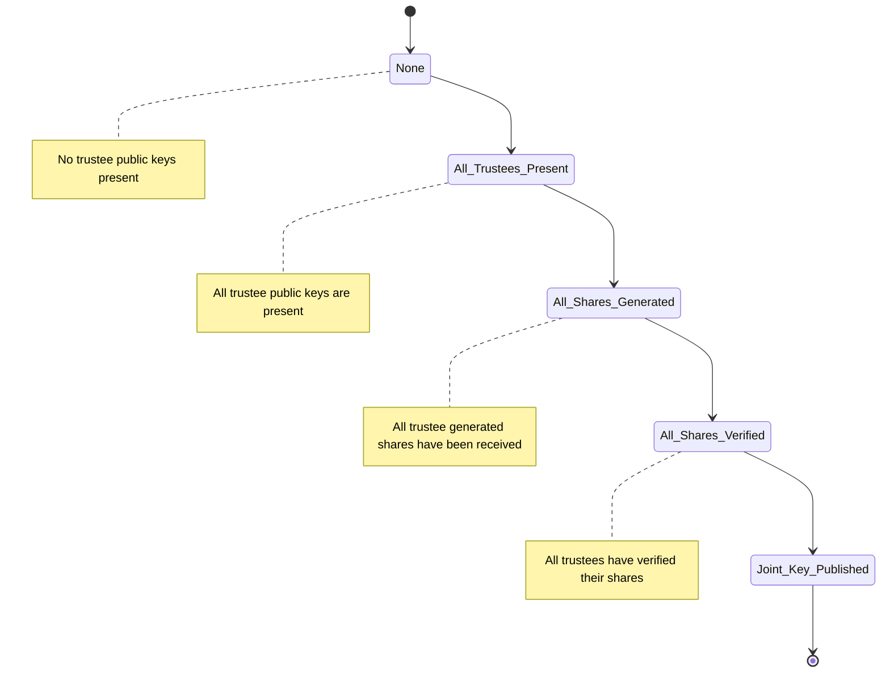

# Key Ceremony

## Glossary

- **Election Key Pair:** Pair of keys (public & secret) used to encrypt/decrypt election
- **Auxiliary Key Pair:** Pair of keys (public & secret) used to encrypt/decrypt information sent between guardians
- **Election Partial Private Secret Key:** Partial piece of a guardian's election private key shared to another guardian
- **Joint Key:** Combined key from election public keys of each guardian
- **Quorum:** Quantity of guardians (k) that is required to decrypt the election and is less than the total number of guardians available (n)

## Process

1. The ceremony details are decided upon. These include a `number of guardians` and `quorum` of guardians required for decryption.
2. Each guardian must generate their `auxiliary key pair`.
3. Each guardian must give the other guardians their `auxiliary public key` directly or through a mediator.
4. Each guardian must check if all `auxiliary public keys` are received.
5. Each guardian must generate their `election key pair` (ElGamal key pair).
6. Each guardian must give the other guardians their `election public key` directly or through a mediator.
7. Each guardian must check if all `election public keys` are received.
8. Each guardian must generate `election partial secret keys` and corresponding Schnorr `proofs` of knowledge for each guardian, but not necessarily for themselves.
9. Each guardian must encrypt `election partial secret keys` for a specific guardian with that guardian's provided `auxiliary public key`
10. Each guardian must send each encrypted `election partial secret key` to the designated guardian directly or through a `mediator`.
    - A public record of the encrypted `election partial secret key` should be created if mediator is not used.
11. Each guardian checks if all encrypted `election partial secret keys` have been received by their recipient guardian directly or through a mediator.
12. Each recipient guardian decrypts each received encrypted `election partial secret key` with their own `auxiliary private key`
13. Each recipient guardian verifies the Schnorr `proof` for each `election partial secret key` and sends confirmation of verification
    - If the proof verifies, continue
    - If the proof fails
      1. Sender guardian publishes the `encrypted partial secret key` sent to recipient to all other guardians\*
      2. Alternate guardian (outside sender or original recipient) attempts to verify key
         - If the proof verifies, continue
         - If the proof fails again, the accused (sender guardian) should be evicted and process should be restarted with new guardian.
14. On receipt of all verifications of `election partial private keys` by all guardians, generate and publish `joint key` from election public keys

\*Note: Since two

### Dispute Notes

Guardian A generates the partial key for Guardian B and sends that partial key to Guardian B.
(Case 1) If Guardian B is happy (the partial key confirms), things proceed normally.
(Case 2) If Guardian B is unhappy, it publicly challenges Guardian A. If challenged, Guardian A is required to simply publish to all guardians the partial key that it generated for Guardian B. (This way, we don’t care or have to adjudicate what was sent originally and don’t need Guardian B to do a provable decryption.)
(Case 2a) If the partial key now fully revealed by Guardian A confirms, everything proceeds normally. (Note that the confidentiality of this partial key is now gone, but since the two Guardians are in dispute, at least one is misbehaving … and can reveal this partial key anyway.)
(Case 2b) If the partial key reveled by Guardian A does not confirm, Guardian A should be excluded from the process which should then be restarted with a substitute guardian.

Note that the only “bad” case is that in which a guardian does not correctly share one or more its partial keys – even when challenged. Without this, if the guardian in question doesn’t perform a correct decryption after the close of the election, it may not be possible for a quorum of guardians to recover the decryption. Thus, the process cannot proceed if a guardian refuses to share its partial keys correctly.

## Key Ceremony (`key_ceremony.py`)

### Stateful Class

```python
class KeyCeremony:
    _number_of_trustees: int #n
    _threshold: int #k

    #-------- PUBLIC KEYS -------

    # KeyCeremony_Coordinator_receive_key_generated
    # Adds the election and messaging public key and returns the trustee id to the trustee to save.
    def receive_trustee_public_keys() --> string:

    # KeyCeremony_Coordinator_all_keys_received
    # KeyCeremony_Coordinator_assert_all_seen
    # Verify all trustee keys have been received and are stored.
    def verify_all_trustee_public_keys_received() --> bool:

    def get_trustee_messaging_public_keys() --> KeyPair[]:

    #-------- SHARES -------

    # KeyCeremony_Coordinator_receive_shares_generated
    # For trustee to identify that they have received all shares
    def receive_trustee_share():

    # KeyCeremony_Coordinator_all_shares_received
    # Verifies that all shares have been received by each of the trustees. Essentially ensure all trustees received all the needed shares.
    def verify_all_trustee_shares_received() --> bool:

    # Get the trustee share set for a particular trustee by id
    def get_trustee_share_set_by_id() --> PrivateKeyShareSet:

    # KeyCeremony_Coordinator_receive_shares_verified
    # Receive a single trustees verification of the shares
    def receive_trustee_share_verification():

    # KeyCeremony_Coordinator_receive_shares_verified
    # Verify all trustees have verified their received shares
    def verify_trustee_share_verification_received() --> bool:

    # Points to combine_trustee_public_election_keys
    def publish_joint_election_key() --> JointElectionKey
```

### Stateless Methods

_Could add generic methods for the points in coordinator_

```python
# KeyCeremony_Coordinator_publish_joint_key
def combine_trustee_public_election_keys() --> JointElectionKey
```

Get the public encryption key for the election to be used for decryption

### State Diagram



## Trustee (`trustee.py`)

_Perhaps this should be key_ceremony_trustee OR maybe decryption information is also in this class_

### Stateful Class

Store information pertaining to Trustee.

```python
_messaging_keys: KeyPair
_election_keys: KeyPair
_number_of_trustees: int
_threshold: int

# Hold all keys for other trustees
_trustee_messaging_public_keys: Dictionary
_trustee_election_public_keys: Dictionary
_trustee_election_private_key_shares: Dictionary

def get_shared_key()

def add_trustee_messaging_public_key()

def add_trustee_election_public_key()

def add_trustee_election_private_key_share()
```

### Stateless Methods

```python
# Generate Elgamel keypair
# KeyCeremony_Trustee_generate_key
def generate_election_keys() --> KeyPair
```

Generate the election keypair needed for the election for the trustee.

```python
# KeyCeremony_Trustee_generate_shares
def generate_election_private_key_shares(private_key: string, number_of_trustees: int, threshold: int) --> ElectionKeyShare[]
```

Get the appropriate pieces to share from the private key of a trustee and Schnorr proof for each piece.

```python
# KeyCeremony_Trustee_verify_shares
def verify_election_private_key_share() --> bool
```

Validate a shared private key is proper and the Key Ceremony can continue.

### Helpers

```python
# KeyCeremony_Trustee_generate_key
def generate_messaging_keys() --> KeyPair
```

Optional class to assist trustee in generating key pair for messaging.

```python
def validate_messaging_keys(key_pair: KeyPair) --> boolean
```

Performs proof to check key pair was generated correctly.
