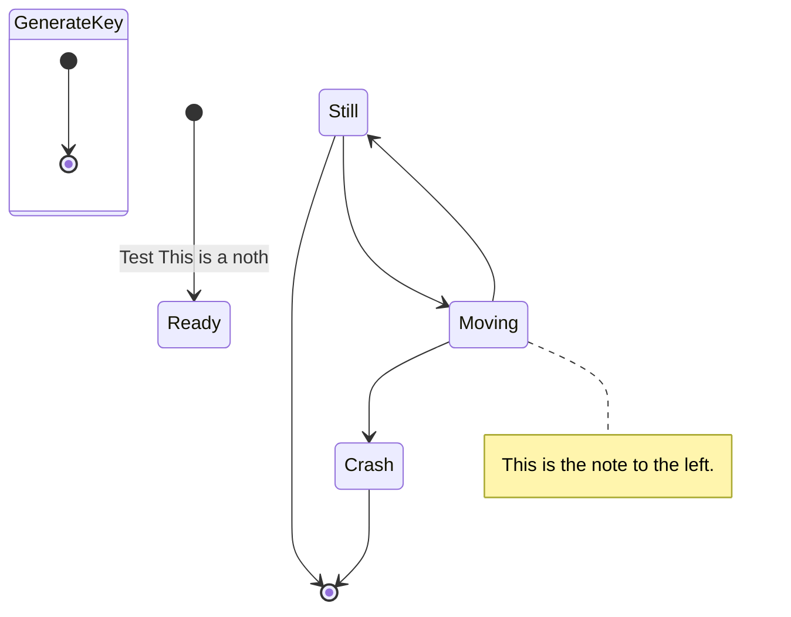
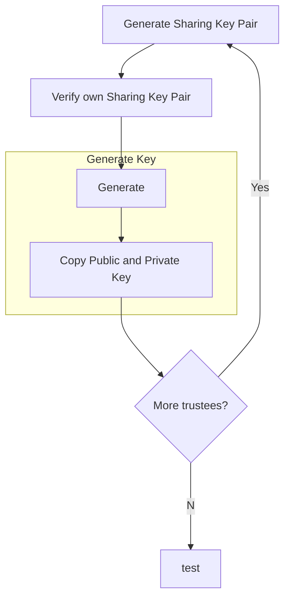
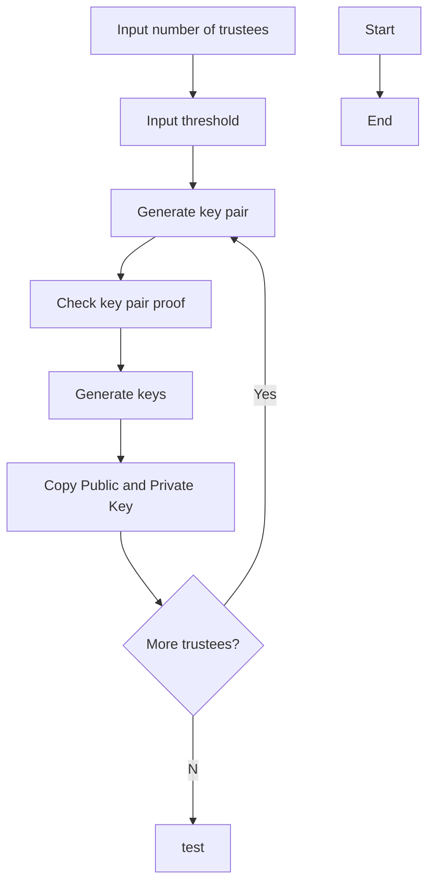

### Share (`share.py`)

The "share" for the trustee to manage the different pieces of information they have recieved.

#### Stateful Class

```python
class Share:
    _id: string
    _key_pair: KeyPair

    def __init__(public_key:string, private_key: string):

    def update_id(id: string):
```

#### Stateless Methods

```python
def decrypt_share()
```

```python
def encrypt_share()
```

### Key Ceremony (`key_ceremony.py`)

#### Stateful Class

```python
_number_of_trustees: int #n
_threshold: int #k
```

#### Stateless Methods

```python
def verify_all_public_keys_present()
```

```python
def get_public_encryption_key()
```

Get the public encryption key for the election to be used for decryption

```python
def combine_public_keys()
```

Combine the public keys provided by trustees

```python
def
```

Description

```python
def get_public_encryption_key()
```

```python
If trustee fails to produce a suitable pil and nonce that match both the published encryption it should be excluded from the election.
Key generation should be restarted with alternate trustee
```

---

### Trustee (`trustee.py`)

#### Stateful Class

Store information pertaining to Trustee.

```python
_sharing_key_pair: KeyPair
_number_of_trustees: int
_threshold: int

def get_shared_key()
```

#### Stateless Methods

```python
def share_public_key(public_key: string) --> PublicKeyShare[]
```

Get the public key and its Schnoor proof to be shared.

```python
def share_private_key(private_key: string, number_of_trustees: int, threshold: int) --> PrivateKeyShare[]
```

Get the appropriate pieces to share from the private key of a trustee and Schnoor proof for each piece.

```python
def validate_shared_private_key()
```

Validate a shared private key is proper and the Key Ceremony can continue.

#### Helpers

```python
def generate_key_pair() --> KeyPair
```

Assist trustee in generating key pair.

```python
def validate_key_pair(key_pair: KeyPair) --> boolean
```

Performs proof to check key pair was generated correctly.

---

Decide on n trustees
Decide on k threshold

Each Trustee generates a public-private key pair

PrivateKeyShare

The public keys are then all combined into single public key to encrypt the selections of the votes

each trustee must share a part of their private key

Each trustee has shared public encryption Ei with the group

Trustee generates k polynomial coefficients.

Trustee then publishes k commitments for each of its random polynomial coefficients.
The constant term serves as private key
K

Trustees have to publically report a computation

- if trustee fails to produce a suitable pil and nonce that match both the published encryptiong it should be expluded from the election. Key generation should be restarted with alternate trustee

Each Key Ceremony includes each verification of the trustee of the public keys

Send Trustee Public Key
Share all public keys
send encryted private key shares
share all encrypted key shares
confirm valid key shares -> distribute election public encryption key

# Key Ceremony

Abides by **Specification v.0.85**
Code examples in Python






