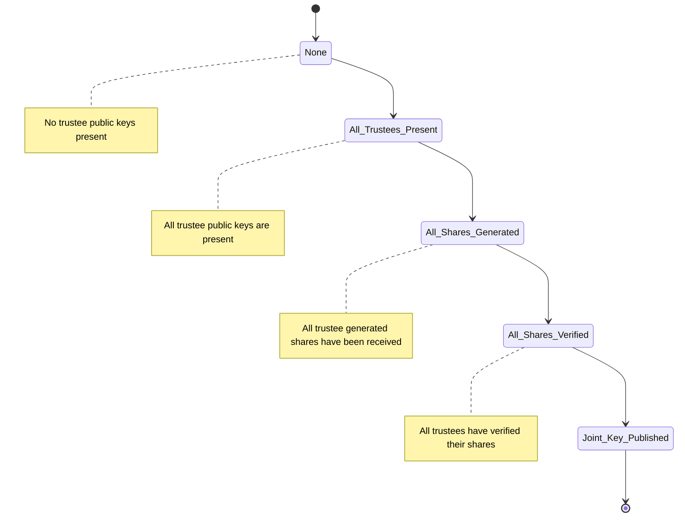

# Key Ceremony

## Glossary

- **Election Keys:** Pair of keys (public & private) used to encrypt/decrypt election
- **Messaging Keys:** Pair of keys (public & private) used to encrypt/decrypt information sent between trustees
- **Private Key Share:** Piece or fragment of a trustee's election private key shared to another trustee
- **Joint Key:** Combined key from election public keys of each trustee
- **Threshold:** Quantity of trustees (k) that is required to decrypt the election and is less than the total number of trustees available (n)

## Process

1. An amount of trustees and threshold is decided upon and input.
2. Each trustee must generate their election keys and messaging keys.
3. Each trustee must give the other trustees their messaging public key. This happens through the coordinator.
   - Trustee can check if all public keys received
   - Trustee can get all public keys
4. Each trustee must generate election private key shares to share with other trustees
5. Each trustee must encrypt designated key share for trustee with that trustees public key
6. Each trustee must send all encrypted key shares to the designated trustees. This happens through the coordinator.
   - Trustee can check if all shares have been received
   - Trustee can get their shares with their own id
     - if they try to get someone elses, they can't decrypt
7. Each trustee must verify that they decrypt their shares
8. Coordinator can publish joint key after all trustees verify their shares

## Key Ceremony (`key_ceremony.py`)

_Replaces coordinator in c code._

### Stateful Class

```python
class KeyCeremony:
    _number_of_trustees: int #n
    _threshold: int #k

    #-------- PUBLIC KEYS -------

    # KeyCeremony_Coordinator_receive_key_generated
    # Adds the election and messaging public key and returns the trustee id to the trustee to save.
    def receive_trustee_public_keys() --> string:

    # KeyCeremony_Coordinator_all_keys_received
    # KeyCeremony_Coordinator_assert_all_seen
    # Verify all trustee keys have been received and are stored.
    def verify_all_trustee_public_keys_received() --> bool:

    def get_trustee_messaging_public_keys() --> KeyPair[]:

    #-------- SHARES -------

    # KeyCeremony_Coordinator_receive_shares_generated
    # For trustee to identify that they have received all shares
    def receive_trustee_share():

    # KeyCeremony_Coordinator_all_shares_received
    # Verifies that all shares have been received by each of the trustees. Essentially ensure all trustees received all the needed shares.
    def verify_all_trustee_shares_received() --> bool:

    # Get the trustee share set for a particular trustee by id
    def get_trustee_share_set_by_id() --> PrivateKeyShareSet:

    # KeyCeremony_Coordinator_receive_shares_verified
    # Receive a single trustees verification of the shares
    def receive_trustee_share_verification():

    # KeyCeremony_Coordinator_receive_shares_verified
    # Verify all trustees have verified their received shares
    def verify_trustee_share_verification_received() --> bool:

    # Points to combine_trustee_public_election_keys
    def publish_joint_election_key() --> JointElectionKey
```

### Stateless Methods

_Could add generic methods for the points in coordinator_

```python
# KeyCeremony_Coordinator_publish_joint_key
def combine_trustee_public_election_keys() --> JointElectionKey
```

Get the public encryption key for the election to be used for decryption

### State Diagram



## Trustee (`trustee.py`)

_Perhaps this should be key_ceremony_trustee OR maybe decryption information is also in this class_

### Stateful Class

Store information pertaining to Trustee.

```python
_messaging_keys: KeyPair
_election_keys: KeyPair
_number_of_trustees: int
_threshold: int

# Hold all keys for other trustees
_trustee_messaging_public_keys: Dictionary
_trustee_election_public_keys: Dictionary
_trustee_election_private_key_shares: Dictionary

def get_shared_key()

def add_trustee_messaging_public_key()

def add_trustee_election_public_key()

def add_trustee_election_private_key_share()
```

### Stateless Methods

```python
# Generate Elgamel keypair
# KeyCeremony_Trustee_generate_key
def generate_election_keys() --> KeyPair
```

Generate the election keypair needed for the election for the trustee.

```python
# KeyCeremony_Trustee_generate_shares
def generate_election_private_key_shares(private_key: string, number_of_trustees: int, threshold: int) --> ElectionKeyShare[]
```

Get the appropriate pieces to share from the private key of a trustee and Schnoor proof for each piece.

```python
# KeyCeremony_Trustee_verify_shares
def verify_election_private_key_share() --> bool
```

Validate a shared private key is proper and the Key Ceremony can continue.

### Helpers

```python
# KeyCeremony_Trustee_generate_key
def generate_messaging_keys() --> KeyPair
```

Optional class to assist trustee in generating key pair for messaging.

```python
def validate_messaging_keys(key_pair: KeyPair) --> boolean
```

Performs proof to check key pair was generated correctly.
